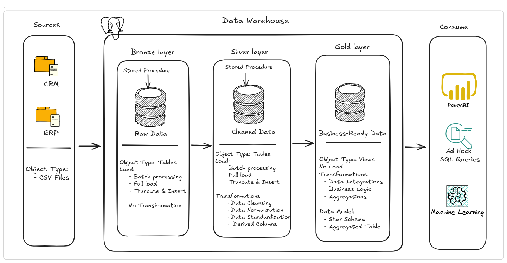

# SQL Data Warehouse Project 

## Overview 
An end-to-end SQL data warehouse implementing Medallion Architecture (Bronze/Silver/Gold) to integrate and clean ERP and CRM data for analytical reporting. 

---
## 🚀 Tech Stack 
* **Database Engine:** PostgreSQL 18 (Hosted via Docker)
* **Containerization:** Docker CLI
* **SQL Dialect:** PostgreSQL (PL/pgSQL)

---
## 📂 Project Structure

```
sql-data-warehouse-project/
├── datasets/
│   ├── source_crm/
│   └── source_erp/
├── docs/
│   ├── data_architecture.png
│   └── naming_conventions.md
├── scripts/
│   ├── 1_bronze/
│   ├── 2_silver/
│   ├── 3_gold/
│   ├── init_database.sql
│   └── init_schemas.sql
├── tests/
└── README.md
```

---
## Setup Instructions

### Prerequisites
 - Docker.
 - PostgreSQL container running.

### 1. Database Setup

Create the database:

```bash 
docker exec -i <container_name> psql -U <user> -d postgres < scripts/init_database.sql
```
Create the schemas:

```bash 
docker exec -i <container_name> psql -U <user> -d data_warehouse < scripts/init_schemas.sql
```

### 2. Loading Source Data


---
## 🏗️ Architecture


### ⚙️ How the Architecture Works
* **Bronze Layer (Staging):** Truncate-and-load raw data wrapped inside a Stored Procedure.
* **Silver Layer (Conformed):** Data cleaning, deduplication, and casting wrapped inside a Stored Procedure.
* **Gold Layer (Analytics):** Business-ready Fact and Dimension tables exposed via a database View.
